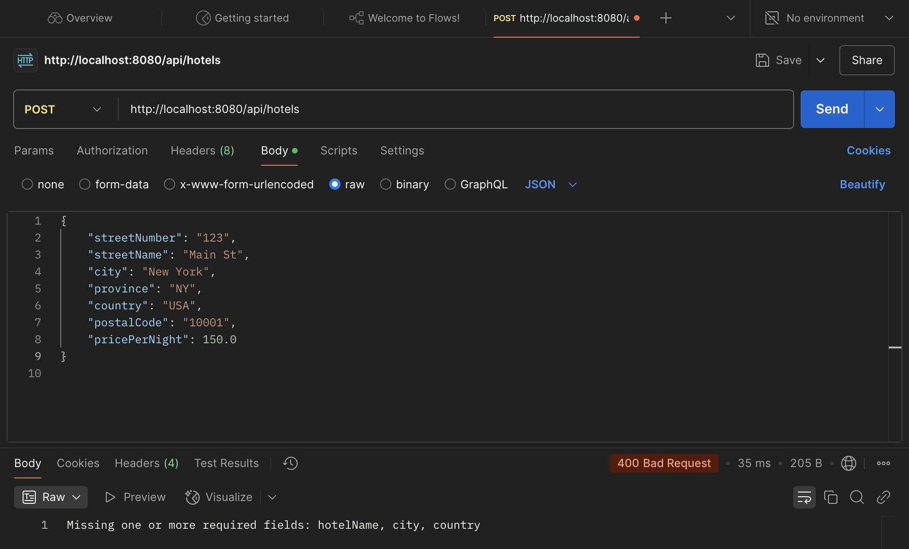

# MCDA5550_HotelRes
A Springboot API for managing hotel reservations.

This project was developed as part of MCDA5550, 
demonstrating how to build a REST API using Springboot, 
SQLite, and postman for testing.

## How to Run API
1. Ensure you have Java and Maven installed:
   - java -version
   - mvn -version
   - if not installed:
     - Install Java from Oracle or OpenJDK
     - Install Maven from Apache Maven
2. Clone the respository by running:
    - git clone <https://github.com/Fearlouise/MCDA5550_HotelRes.git>
    - cd MCDA5550_HotelRes
3. Install dependencies by running: 
   - mvn clean install
4. Run the Springboot application: 
   - mvn spring-boot run
   - This will start the application on http://localhost:8080

## API Commands
### Checking API Works
There are two ways to verify that the API is working:

1. Open in Browser
    - Go to http://localhost:8080 in a browser:
      

2. Use Postman (GET Request):
   - GET http://localhost:8080/api/hotels
   

### "POST" Request
To add a new hotel, send a POST request in Postman:

1. Method: POST
2. Endpoint: http://localhost:8080/api/hotels
3. Body example (JSON):
   {
   "hotelName": "Hilton Garden Inn",
   "streetNumber": "123",
   "streetName": "Main St",
   "city": "New York",
   "province": "NY",
   "country": "USA",
   "postalCode": "10001",
   "pricePerNight": 150.0
   }

Examples of a successful POST request:

Example of a failed POST request (missing required fields)

### Verify "POST" Request Works
After adding hotels, you can retrieve them using:

1. Postman GET Request:

2. Open in Browser: http://localhost:8080

### "DELETE" Request
To delete a hotel, send a DELETE request

1. Method: DELETE
2. Endpoint: http://localhost:8080/api/hotels/{id}

Example of a successful DELETE Request:

Example of a failed DELETE Request (non-existent hotel)

### Verify "DELETE" Request Works
After deleting hotels, you can verify deletion using:

1. Postman GET Request:
   

2. Open in Browser: http://localhost:8080
   
    
## Conclusion
This API provides a simple way to manage hotel listing using **Springboot** and **SQLite** .
It supports basic operations like:
- **GET**: Retrieve a list of available hotels.
- **POST**: Add new hotels to the database.
- **DELETE**: Remove hotels by their ID.

### Future Improvements
Potential enhancements for this API include:
- **Adding a Customer and Reservation System**: To track bookings and allow customers to reserve hotels.
- **Managing Hotel Availability**: Implementing logic to check and update available rooms in a hotel.
- **Access Control and Permissions**: Restricting actions like deleting hotels to authorized users only.

These features would improve the API's functionality, making it a **fully functional hotel reservation system**.

